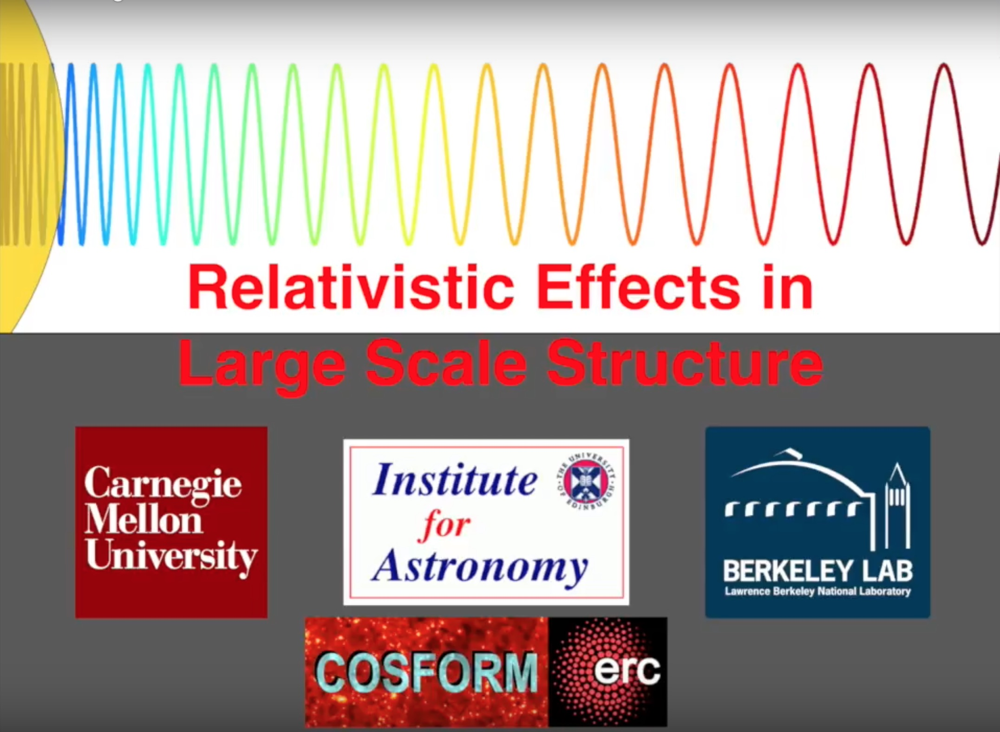

# Research
My research interests are focused on deepening understanding of our Universe. I am interested in
studying a variety of topics in theoretical cosmology using cosmological data. 
My major fields of research include: neutrino Cosmology, dark energy, Cosmic Microwave Background (CMB) radiation and large-scale structure (LSS). \\
In particular I investigate the impact of neutrino masses on cosmological observables and I contribute in analyzing some of the most recent publicly available
datasets in order to provide updated constraints on the sum of the three active neutrino masses. I also interested in exploring the bounds on the active and sterile neutrino
masses as well as on the number of neutrino species within the ΛCDM cosmological scenario
as well as in other extended scenarios.\\
I have also worked on other topics such as axion cosmology and inflationary and modified gravity models.

My recent works has focused on large-scale structure:

### **Constraining the scale-dependent galaxy bias and neutrino masses using CMB lensing**

Large-scale structure is the best candidate for precision cosmology probes. The clustering information usually comes in the form of galaxy power spectrum measurements. In particular the
full shape of the matter power spectrum, that is proportional to the galaxy power spectrum,
is crucial in order to constrain the shape of the primordial power spectrum and other cosmological
parameters, in particular the absolute scale of neutrino masses. \\
The constraining power of this
quantity depends sensitively by uncertainties in the modeling of the scale-dependent galaxy bias, *b(k)*.
This work presents a new method to constrain the scale-dependent bias by using the cross-correlation
between the Cosmic Microwave Background (CMB) lensing signal and galaxy maps considering a simple parametrization for *b(k)*.
In order to study the increase in constraining power of the matter power spectrum, we apply this methodology to derive the constraints on the sum of neutrino masses.\\
For more details see: [arXiv:1802.08694](https://arxiv.org/pdf/1802.08694.pdf)

### **Relativistic effects in Large Scale Structure**

In this work we have studied the gravitational redshift and other relativistic effects, such as special relativistic beaming, transverse
Doppler redshift and light cone effect, in large-scale structure. Gravitational redshift is one of the
major predictions of General Relativity and thus can be used to test the cosmological theories and study cosmic structures. This effect, together with other relativistic effects, produces an asymmetry
in the two points cross-correlation function of two populations of galaxies, that can be quantified in two ways: using the dipole moment in the cross-correlation function and the shell estimator (introduced by [Croft 2013](https://arxiv.org/pdf/1304.4124.pdf)). 
The gravitational redshift is a very small effect and therefore it could be difficult to detect. In order to model all the distortions, we have computed the dipole and the shell estimator of two galaxies populations using three different approaches: N-body
simulation, General Relativistic perturbation theory and Newtonian perturbation theory. We have also measured for the first time these asymmetries in large-scale structure using SDSS BOSS DR12 CMASS sample, finding a detection
of galaxy gravitational redshifts at 2.7σ.\\
For more details see:
* [Modeling relativistic asymmetries using perturbation theory](https://arxiv.org/pdf/1709.07854.pdf).
* [Modeling relativistic asymmetries using N-body simulations](https://arxiv.org/pdf/1709.07859.pdf).
* [Measuring gravitational redshift with SDSS BOSS DR12 CMASS sample](https://arxiv.org/pdf/1709.07855.pdf).
* [Special relativistic beaming](https://arxiv.org/pdf/1709.07856.pdf).

Here you can also find a video that summaries our papers: \\
